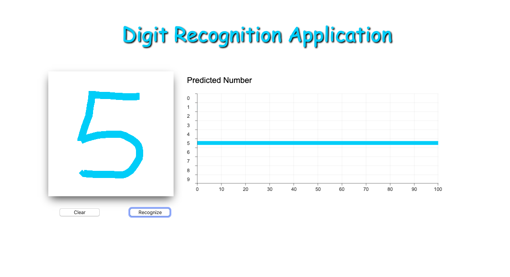

# Digit-recognition

It is a simple application for digit recognition using a convolutional neural network. 

## Get Started
- Run `npm start` in the terminal
- Open [http://localhost:3000/index.html](http://localhost:3000/index.html) in your browser
- Draw a number and click `recognize` to get a prediction

- To adapt the neural network, run commands `pipenv install`, `pipenv shell` and `jupyter notebook`